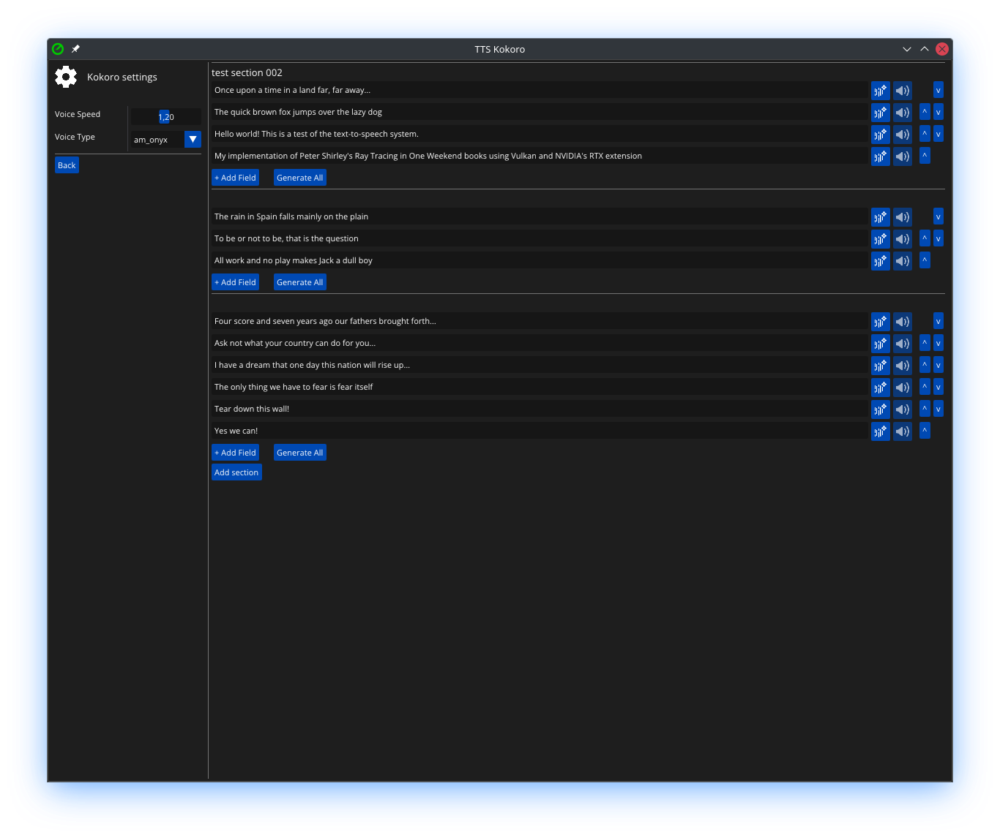

# Kokoro TTS GUI

A simple, cross-platform application for generating text-to-speech audio using Kokoro with an intuitive graphical interface.

---

## 1. Overview

`Kokoro TTS GUI` simplifies text-to-speech generation by providing:
- Project-based organization for your voice content
- Real-time audio generation and playback
- Customizable voice parameters (speed, voice type)
- Simple interface built with **ImGui** and **GLFW**


## 2. Features

- **Project Management**: Organize text content into sections and projects
- **Voice Customization**: Choose from 50+ voices and adjust speech speed
- **Audio Workflow**: Generate → Preview → Export workflow
- **Cross-Platform Support**: Linux (Windows coming soon)
- **One-Click Setup**: Automatic dependency installation

## 3. Prerequisites

* **Git** (with submodule support)
* **C++20** compatible compiler
* **Python 3+**

## 4. Installation & Setup

### Automated Setup (Recommended)
Run the setup script to install dependencies and configure the environment:
```bash
python3 setup.py
```

During the first setup (which may take several minutes), you'll see this initialization screen while downloading the models and voices:


The script will:
1. Create Python virtual environment
2. Install Kokoro dependencies
3. Download voice models (800MB)
4. Configure build system

## 5. Building the Application

### VSCode (Recommended)
1. Open project in VSCode
2. Build: <kbd>Ctrl</kbd>+<kbd>Shift</kbd>+<kbd>B</kbd>
3. Run: <kbd>F5</kbd> (will rebuild)

### Manual Build
```bash
cd TTS_app
.vscode/build.sh
make -j
bin/Debug-linux-x86_64/TTS_app/TTS_app
```

## 6. Usage Guide

### Interface Overview
1. **Sidebar** (left): Application controls
   - **Settings Panel**: Configure voice parameters
   - **Project Panel**: Mange projects
2. **Content Area** (center): Manage text sections



### Basic Workflow
1. **Add Sections**: Click "Add Section" to create content groups
2. **Enter Text**: Type/paste text into input fields
3. **Generate Audio**: Click → next to text field
4. **Preview**: Click 🔊 to hear generated audio
5. **Export**: Audio files save to `audio/` directory

### Key Controls
| Button | Function |
|--------|----------|
|  | Generate audio from text |
|  | Play generated audio |
|  | Stop playback |
|  | Voice configuration |
|  | Project management |

## 7. Customization
Modify these settings via the settings panel (gear icon):
- **Voice Type**: 50+ options (e.g., `am_onyx`, `bf_emma`)
- **Speed**: 0.5x-2.0x normal speech rate
- **Audio Format**: WAV (16-bit PCM)

## 8. Troubleshooting
**Problem**: Audio playback fails  
**Solution**: Install system audio packages:

```bash
sudo apt install alsa-utils mpg123     # Ubuntu/Debian
sudo dnf install alsa-utils mpg123     # Fedora
```

**Problem**: Python module errors  
**Solution**: Re-run setup script:
```bash
python3 setup.py 
```

## 9. Contributing
Contributions welcome! Please:
1. Fork the repository
2. Follow existing C++20 coding style
3. Test on Linux systems
4. Update documentation for new features

## 10. License
[Apache License](LICENSE)
